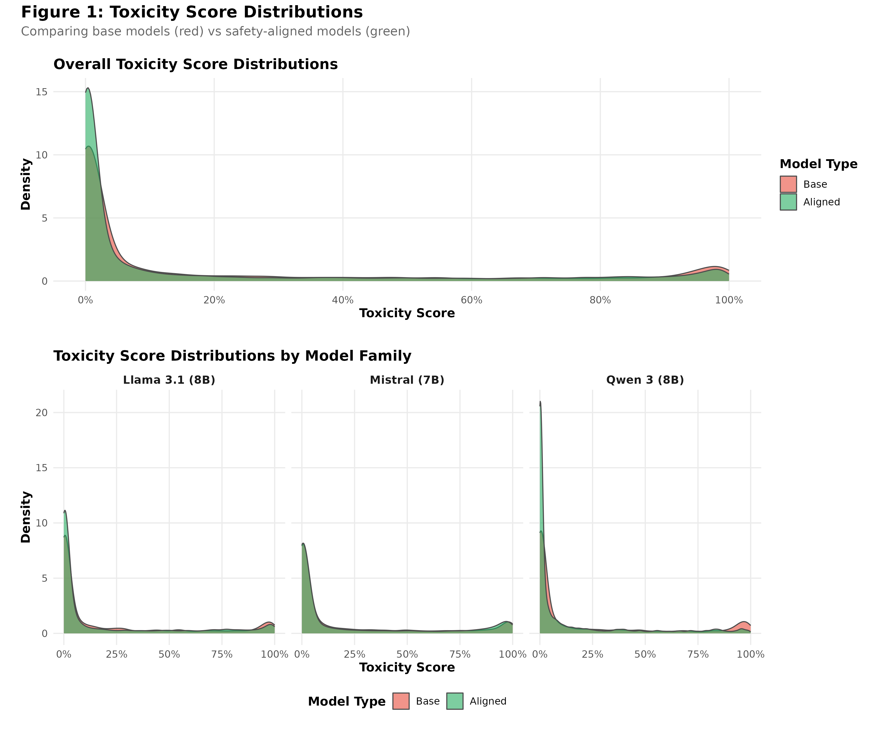
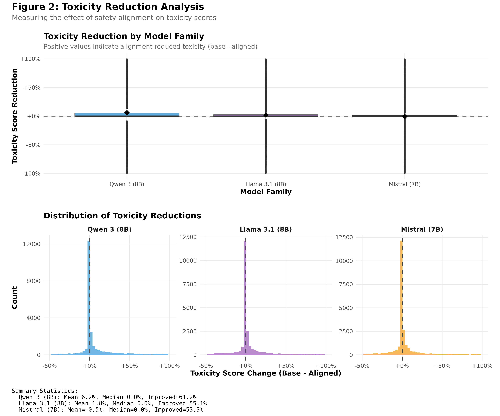
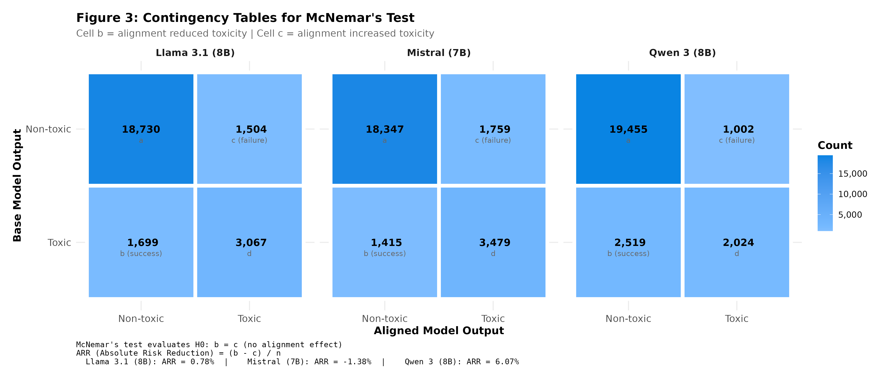
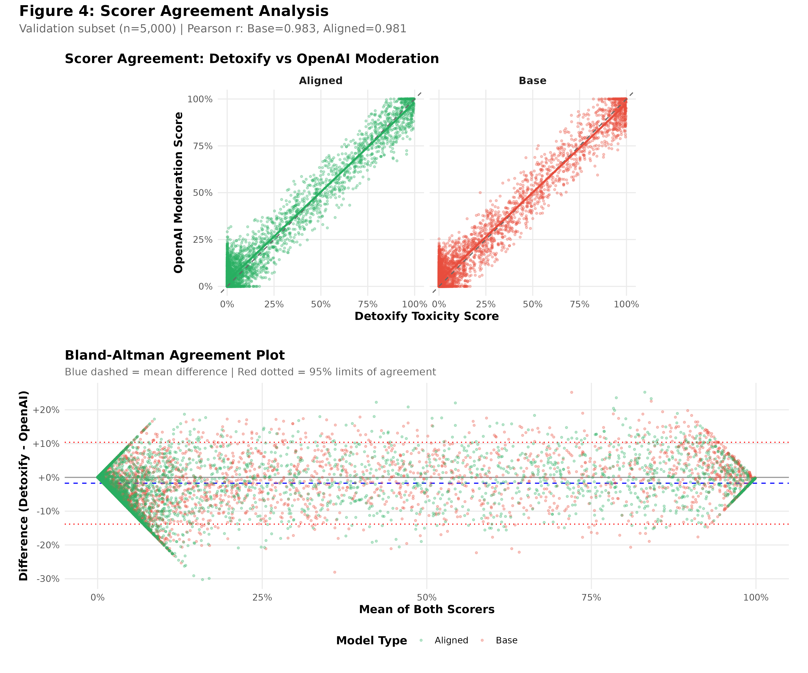
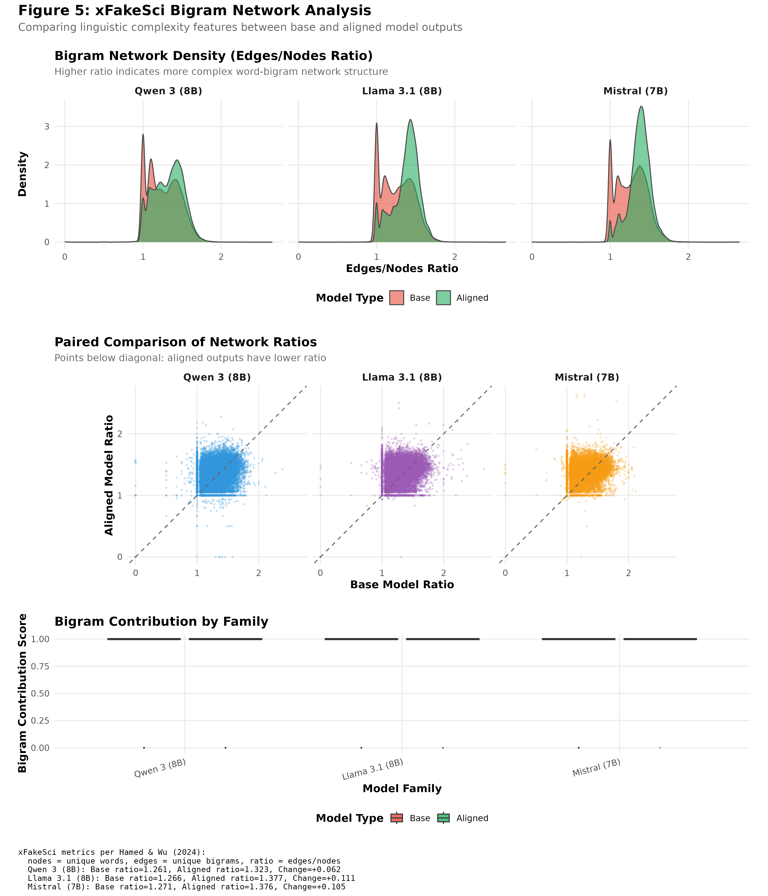

```{r setup, include=FALSE}
knitr::opts_chunk$set(
  echo = FALSE,
  message = FALSE,
  warning = FALSE,
  fig.align = "center",
  fig.pos = "H"
)

library(tidyverse)
library(exact2x2)
library(coin)
library(DescTools)
library(knitr)
library(patchwork)
```

# Introduction

Large language models (LLMs) risk producing harmful content including hate speech, threats, and misinformation. Safety alignment techniques---RLHF, DPO, and SFT---aim to reduce toxic outputs while preserving utility. Despite widespread adoption, empirical evidence quantifying alignment effectiveness across model families remains limited.

This study asks: **Does safety alignment significantly reduce toxic outputs, and does effectiveness differ across model families?** We compare base versus aligned models from three families (Qwen 3, Llama 3.1, Mistral) using 25,000 prompts from toxicity benchmarks, quantifying absolute risk reduction via paired statistical tests.

# Data and Methods

We sampled 25,000 prompts: 12,500 from RealToxicityPrompts (Gehman et al., 2020) stratified by toxicity tertiles, and 12,500 from ToxiGen (Hartvigsen et al., 2022) adversarial examples targeting 13 demographic groups.

| Family | Base Model | Aligned Model | Parameters |
|--------|------------|---------------|------------|
| Qwen 3 | Qwen/Qwen3-8B-Base | Qwen/Qwen3-8B | 8B |
| Llama 3.1 | meta-llama/Llama-3.1-8B | meta-llama/Llama-3.1-8B-Instruct | 8B |
| Mistral | mistralai/Mistral-7B-v0.3 | mistralai/Mistral-7B-Instruct-v0.3 | 7B |

Inference used deterministic decoding (temperature = 0.0, max 128 tokens). We scored 150,000 completions using Detoxify (Hanu & Unitary, 2020) with binary threshold 0.5. For robustness, 5,000 pairs per family were validated with OpenAI Moderation API.

# Statistical Methods

**McNemar's Test (Primary):** For paired binary outcomes, we construct a $2 \times 2$ contingency table where cells $b$ (base toxic, aligned non-toxic) and $c$ (opposite) represent discordant pairs. The test evaluates $b \ne c$: $\chi^2 = (b - c)^2/(b + c)$. Effect size is Absolute Risk Reduction: ARR $= (b - c)/n$, with 95% CIs via bootstrap.

**Wilcoxon Signed-Rank (Secondary):** Tests paired differences $d_i = \text{tox\_base}_i - \text{tox\_aligned}_i$ nonparametrically. Reports Z statistic, pseudomedian, and effect size $r = Z/\sqrt{n}$.

**Cochran's Q (Tertiary):** Tests heterogeneity of "alignment success" (base toxic $\to$ aligned non-toxic) across $k=3$ families. Q follows $\chi^2_{k-1}$ under $H_0$.

# Results

```{r load-data}
mcnemar_results <- read_csv("../output/tables/mcnemar_results.csv", show_col_types = FALSE)
wilcoxon_results <- read_csv("../output/tables/wilcoxon_results.csv", show_col_types = FALSE)
cochran_results <- read_csv("../output/tables/cochran_q_results.csv", show_col_types = FALSE)
```

Base models produced toxic outputs at 18.9% versus 17.1% for aligned. Effects varied by family: Qwen 3 (18.2% $\to$ 12.1%), Llama 3.1 (19.1% $\to$ 18.3%), Mistral (19.6% $\to$ 21.0%, *increase*).

```{r fig1, out.width="90%", fig.cap="Toxicity score distributions by model type."}

```

**McNemar's Test (Table 1):** All families showed significant effects (p < 0.001). Qwen 3: ARR = 6.1% (95% CI: [5.6%, 6.5%], $\chi^2$ = 653.59). Llama 3.1: ARR = 0.8% ($\chi^2$ = 11.87). Mistral: ARR = -1.4% ($\chi^2$ = 37.28)---alignment *increased* toxicity.

```{r table1}
mcnemar_display <- mcnemar_results %>%
  select(family_label, cell_b, cell_c, chi_squared, p_value, arr, arr_ci_lower, arr_ci_upper) %>%
  mutate(ci_95 = sprintf("[%.3f, %.3f]", arr_ci_lower, arr_ci_upper), p_value = sprintf("%.2e", p_value)) %>%
  select(family_label, cell_b, cell_c, chi_squared, p_value, arr, ci_95)
kable(mcnemar_display, caption = "McNemar's Test Results by Model Family",
      col.names = c("Family", "b", "c", "Chi-sq", "p-value", "ARR", "95% CI"), digits = c(0, 0, 0, 2, NA, 3, NA))
```

Figure 2 shows toxicity reduction; Figure 3 shows contingency tables highlighting discordant pair asymmetry.

```{r fig2, out.width="90%", fig.cap="Toxicity reduction by model family."}

```

```{r fig3, out.width="90%", fig.cap="Contingency tables showing discordant pairs."}

```

**Wilcoxon Signed-Rank (Table 2):** Qwen 3 (Z = 42.87, r = 0.27, medium), Llama 3.1 (Z = 16.68, r = 0.11, small), Mistral (Z = 8.80, r = 0.06). Continuous scores show Mistral reduced average toxicity, but binary analysis reveals increased threshold-crossing.

```{r table2}
wilcoxon_display <- wilcoxon_results %>%
  select(family_label, z_statistic, p_value, pseudomedian, effect_size_r, pct_improved) %>%
  mutate(p_value = sprintf("%.2e", p_value))
kable(wilcoxon_display, caption = "Wilcoxon Signed-Rank Test Results",
      col.names = c("Family", "Z", "p-value", "Pseudomedian", "r", "% Improved"), digits = c(0, 2, NA, 4, 3, 1))
```

**Cochran's Q:** Significant heterogeneity ($Q$ = 442.12, $df$ = 2, $p$ = 9.9 $\times$ 10$^{-97}$). All families differ (p < 10$^{-7}$). Success rates: Qwen 3 (55.4%), Llama 3.1 (35.6%), Mistral (28.9%).

**Robustness (Figure 4):** Detoxify-OpenAI agreement: r = 0.98, $\kappa$ > 0.93. Both scorers agree on direction for all families.

```{r fig4, out.width="90%", fig.cap="Scorer agreement between Detoxify and OpenAI Moderation."}

```

**xFakeSci (Figure 5):** Exploratory linguistic pattern analysis using features from Hamed & Wu (2023).

```{r fig5, out.width="90%", fig.cap="xFakeSci ratio distributions."}

```

# Discussion

Our findings challenge the assumption that alignment universally reduces toxicity. Results varied dramatically: Qwen 3 (ARR = 6.1%), Llama 3.1 (ARR = 0.8%), and surprisingly, Mistral (ARR = -1.4%, *increased* toxicity). The robustness analysis confirms these findings---Detoxify and OpenAI Moderation showed near-perfect agreement (r = 0.98, $\kappa$ > 0.93), with concordant conclusions for all families.

Limitations include reliance on automated classifiers (though validated by inter-scorer agreement), deterministic decoding (temperature = 0) which may not generalize, and the conventional 0.5 toxicity threshold. The cross-family heterogeneity ($Q$ = 442.12, p < 10$^{-96}$) suggests alignment interacts with architecture in complex ways. The negative Mistral result is particularly concerning---some alignment procedures may inadvertently increase harmful outputs. Future work should investigate whether specific methods (RLHF, DPO, SFT) differentially affect toxicity.

# References

Gehman, S., Gururangan, S., Sap, M., Choi, Y., & Smith, N. A. (2020). RealToxicityPrompts: Evaluating neural toxic degeneration in language models. *Findings of EMNLP 2020*.

Hamed, A. A., & Wu, X. (2023). Detection of ChatGPT fake science with the xFakeSci learning algorithm. https://arxiv.org/pdf/2308.11767

Hanu, L., & Unitary team. (2020). Detoxify. GitHub repository. https://github.com/unitaryai/detoxify

Hartvigsen, T., Gabriel, S., Palangi, H., Sap, M., Ray, D., & Kamar, E. (2022). ToxiGen: A large-scale machine-generated dataset for adversarial and implicit hate speech detection. *Proceedings of ACL 2022*.

Ouyang, L., Wu, J., Jiang, X., et al. (2022). Training language models to follow instructions with human feedback. *Advances in Neural Information Processing Systems, 35*.

Rafailov, R., Sharma, A., Mitchell, E., et al. (2023). Direct preference optimization: Your language model is secretly a reward model. *Advances in Neural Information Processing Systems, 36*.
